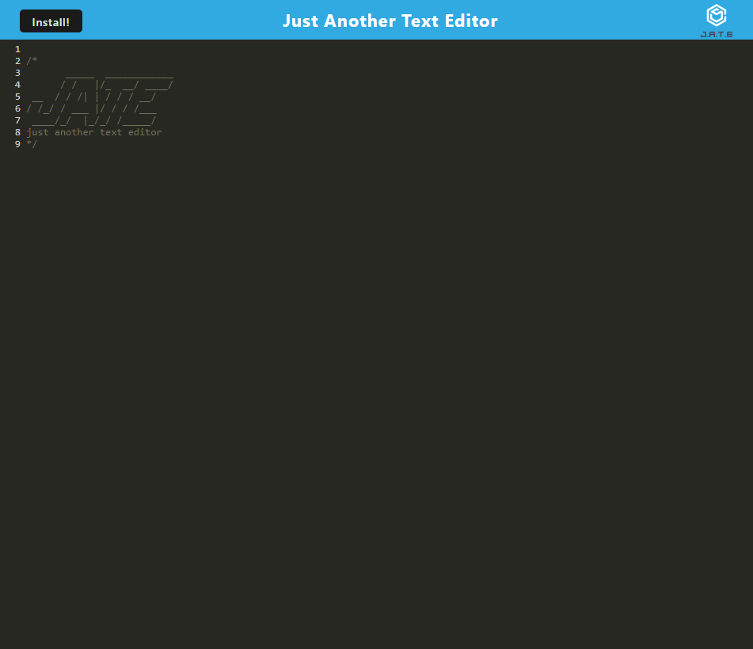

# Just Another Text Editor (JATE)

  [Please Visit The Deployed Application](https://warm-gorge-50869-2d02043c46e5.herokuapp.com/)
  

  ## Table of Contents

  * [License](#license)
  * [Description](#description)
  * [Installation](#installation)
  * [Usage](#usage)
  * [Learning Points](#learning-points)
  * [Contacts](#contacts)
  
  ## License
    
  ODbl
  [](https://opendatacommons.org/licenses/odbl/)
  This JATE is made available under the Open Database License: http://opendatacommons.org/licenses/odbl/1.0/. Any rights in individual contents of the database are licensed under the Database Contents License: http://opendatacommons.org/licenses/dbcl/1.0/

  ## Description
    
  JATE is a text editor which runs online, offline and can be downloaded for use anywhere! The goal with this application was to further my knowledge concerning PWA's (Progressive Web Applications), I was responsible for the implementation of the installable functionality as well as the setting of the service worker in this application. With that being said all functionality concerning data stored within the indexedDB was written by me.
    
  ## Installation
    
  The installation of JATE is as simple as clicking the "install" button when opening the application. JATE is even smart enough to determine whether you have it installed on your device or not and will ask you to open it locally accordingly.
    
  ## Usage
    
  As the name implies, JATE is "just another text editor" however it is focused on being able to store your notes no matter where you decide to open them! JATE stores your notes for use at any point, anywhere!

  ## Learning Points

  When it came to learning about PWA's, service workers and the general functionality of them it was a very difficult concept for me to first grasp. Bundling together files so they can be passed along to the client whilst consuming a lot less data is essentially what I came to understand as their purpose. Here is an example of a code snippet where I bundle a multitude of front end files into one.

  ```js
  module.exports = () => {
  return {
    mode: 'development',
    entry: {
      main: './src/js/index.js',
      install: './src/js/install.js',
      // header: './src/js/header.js'
    },
    output: {
      filename: '[name].bundle.js',
      path: path.resolve(__dirname, 'dist'),
    },
    plugins: [
      new HtmlWebpackPlugin({
        template: './index.html',
        title: 'JATE Text Editor'
      }),
      new InjectManifest({
        swSrc: './src-sw.js'
      }),
      new WebpackPwaManifest
      ...
  ```
---
As stated before, I was responsible for the handling of data through the use of "indexedDB", a locally accessible database responsible for storing your JATE notes! here is a code snippet showing the functionality of retrieving your JATE's data as well as modifying it.
  ```js

  export const putDb = async (content) => {
  console.log('PUT into db');
  const jateDb = await openDB('jate', 1);
  const tx = jateDb.transaction('jate', 'readwrite');
  const store = tx.objectStore('jate');
  const request = store.put({id: 1, value: content});
};

export const getDb = async () => {
console.log('GET from db');
const jateDb = await openDB('jate', 1)
const tx = jateDb.transaction('jate', 'readonly');
const store = tx.objectStore('jate');
const request = store.get(1);
const result = await request;
return result?.value;
};
  ```
    
  ## Contacts

  * Github: https://github.com/JackLCmore

  * LinkedIn: https://www.linkedin.com/in/jack-seymour-b0b2b0292/

  * Email: jack.lcmore@gmail.com
    
  
